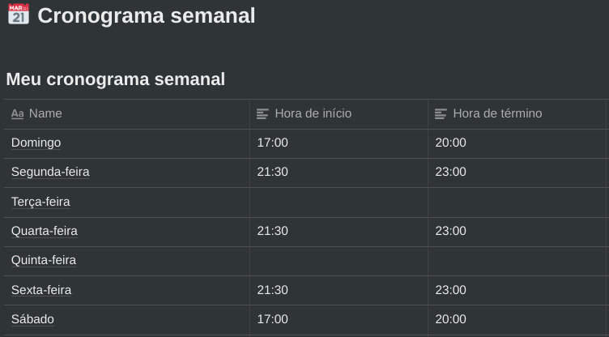
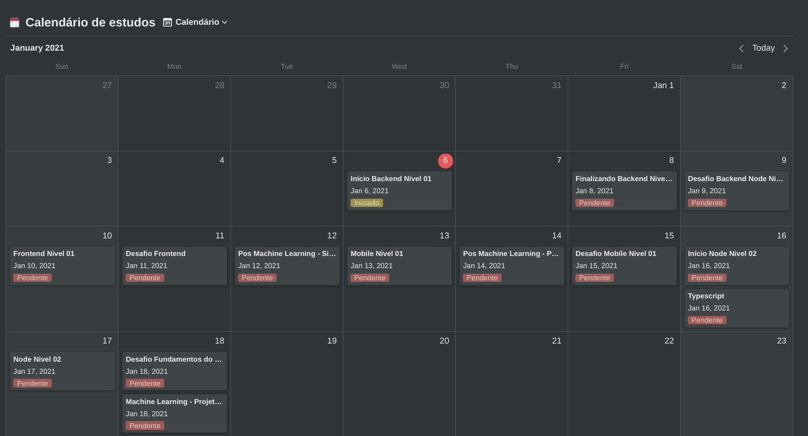

# Desafio 01

## Cronograma Semanal

Segue horários planejados para estudo, visto que trabalho com desenvolvimento de projetos e atualmente estou
numa pós de Machine Learning, estou tentando planejar o melhor possível para estudar um pouco a cada dia de ambos.

## Cronograma Diário

Segue horários planejados para estudo de cada dia, conciliando aulas da pós, projeto final da 
pós e vídeo aulas e desafios do gostack.

Segue abaixo link do Notion com meu cronograma para acompanhamento futuro:

https://www.notion.so/Cronograma-de-estudos-579c6197295f4904aeff05afdb275be5